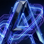

# Agunnaya Labs - Asset Inventory & Usage Guide

## Complete Branding Assets

All logo files, icons, and brand assets are located in `/public` directory and organized by type.

---

## Logo & Icon Assets

### Primary Logo

#### `/public/agl-logo.svg`
- **Type**: SVG (Scalable Vector)
- **Dimensions**: 256x256px (scalable)
- **Format**: Optimized SVG with embedded neon green gradient
- **Usage**: Navbar, tabs, browser bookmarks, high-res displays
- **Background**: Works on light and dark backgrounds
- **Color**: Neon Green (#39FF14) with glow effect
- **Rendering**: HTML
```html

```

#### `/public/agl-logo.png`
- **Type**: PNG (Raster, 32-bit with transparency)
- **Dimensions**: 256x256px
- **File Size**: ~962KB (optimized)
- **Usage**: Fallback for SVG, app icons, marketing materials
- **Background**: Transparent (see-through)
- **Rendering**: HTML img tag
```html

```

---

### Favicon Assets

#### `/public/favicon.ico.png`
- **Type**: PNG (favicon format)
- **Dimensions**: 64x64px
- **File Size**: ~320KB
- **Usage**: Browser tab icon, favorites bar
- **Best For**: Desktop browsers
- **Automatic**: Referenced in `<head>` tag
```html
<link rel="icon" href="/favicon.ico.png" sizes="64x64" type="image/png" />
```

#### `/public/icon.svg`
- **Type**: SVG (light variant)
- **Dimensions**: 32x32px
- **Usage**: Sidebar icons, compact displays
- **Background**: Light theme compatible

---

### Mobile & App Icons

#### `/public/app-icon.png`
- **Type**: PNG (Apple touch icon)
- **Dimensions**: 180x180px
- **File Size**: ~502KB
- **Usage**: iPhone/iPad home screen, app shortcut
- **Best For**: iOS devices
- **Styling**: Rounded corners matching iOS app style
- **Referenced In**: Manifest & HTML head

#### `/public/apple-icon.png`
- **Type**: PNG (Apple specific)
- **Dimensions**: Varies (typically 180x180+)
- **File Size**: ~2.6KB
- **Usage**: Legacy Apple device support
- **Compatibility**: iOS < 15

---

## Social & Marketing Assets

### Open Graph Image

#### `/public/og-image.png` & `/images/og-image.png`
- **Type**: PNG (OG meta)
- **Dimensions**: 1200x630px (16:9 ratio)
- **File Size**: ~1.2MB
- **Usage**: Social media sharing (Twitter, Facebook, LinkedIn, Discord)
- **Auto-Used**: When content is shared without custom image
- **Where Referenced**: 
  - Meta tags in `layout.tsx`
  - Manifest.json screenshots
- **Content**: AGL logo, neon aesthetic, "GameFi & DeFi on Base" text

### Social Banner

#### `/public/social-banner.png`
- **Type**: PNG (Social sharing)
- **Dimensions**: 1200x600px (2:1 ratio)
- **File Size**: ~917KB
- **Usage**: Twitter headers, LinkedIn banners, Discord banners
- **Best For**: Social media profile customization
- **Design**: Neon green AGL logo, dark background, circuit elements

---

## Page & Marketing Assets

### Hero Banner

#### `/public/hero-banner.png`
- **Type**: PNG (Full-width hero)
- **Dimensions**: 1920x1080px (16:9 ratio)
- **File Size**: ~1.2MB
- **Usage**: Large page headers, promotional materials
- **Quality**: High resolution for large displays
- **Placement**: Above-the-fold hero sections

---

## PWA & Web App Assets

### `/public/manifest.json`
- **Type**: JSON (Web App Manifest)
- **Size**: ~3KB
- **Purpose**: PWA installation, app metadata
- **Contains**:
  - App name and description
  - Icon references (all formats)
  - App shortcuts (Buy, Stake, Tokenomics)
  - Share target configuration
  - Screenshots for app stores
  - Dark theme colors

**Features:**
- Installed on home screen as native app
- Shortcuts to Buy AGL, Stake, Tokenomics
- Smart banners on mobile devices
- Splash screens on launch

---

## Search & SEO Assets

### Robots.txt

#### `/public/robots.txt`
- **Purpose**: Search engine crawler instructions
- **Contains**: Sitemap URL, crawl rules
- **Automatic**: Served from root path

### Sitemap

#### `/app/sitemap.ts` (Generated at `/sitemap.xml`)
- **Purpose**: Search engine indexing
- **Routes**: All pages with priorities
- **Auto-Generated**: By Next.js at build time
- **Includes**: Home, tokenomics, team, about, whitepaper, stake

---

## Asset Placement Reference

```
/vercel/share/v0-project/
├── public/
│   ├── agl-logo.svg              ← Primary logo (SVG, scalable)
│   ├── agl-logo.png              ← Logo backup (PNG, 256x256)
│   ├── favicon.ico.png           ← Browser tab icon (64x64)
│   ├── app-icon.png              ← Mobile home screen (180x180)
│   ├── social-banner.png         ← Social sharing (1200x600)
│   ├── og-image.png              ← OG sharing (1200x630)
│   ├── hero-banner.png           ← Page hero (1920x1080)
│   ├── manifest.json             ← PWA configuration
│   ├── robots.txt                ← SEO crawlers
│   ├── images/
│   │   ├── agl-logo-neon.png     ← Alternate neon logo
│   │   └── og-image.png          ← Backup OG image
│   └── [other assets]
├── app/
│   ├── sitemap.ts                ← SEO sitemap generator
│   └── layout.tsx                ← Logo/favicon references
├── BRANDING.md                   ← Comprehensive brand guide
└── ASSETS.md                     ← This file
```

---

## File Size Summary

| Asset | Type | Size | Usage |
|-------|------|------|-------|
| agl-logo.svg | SVG | 1.5KB | Primary (scalable) |
| agl-logo.png | PNG | 962KB | Fallback |
| favicon.ico.png | PNG | 320KB | Browser tabs |
| app-icon.png | PNG | 502KB | Mobile home |
| og-image.png | PNG | 1.2MB | Social sharing |
| social-banner.png | PNG | 917KB | Social profiles |
| hero-banner.png | PNG | 1.2MB | Page headers |
| manifest.json | JSON | 3KB | PWA config |
| **Total** | - | **~5.7MB** | - |

---

## How to Use Assets in Code

### SVG Logo in Navbar
```tsx

```

### PNG Logo with Fallback
```tsx
<picture>
  <source srcSet="/agl-logo.svg" type="image/svg+xml" />
  
</picture>
```

### Social Sharing (Next.js)
```tsx
export const metadata: Metadata = {
  openGraph: {
    images: [
      {
        url: '/og-image.png',
        width: 1200,
        height: 630,
        alt: 'AGL Token',
      },
    ],
  },
}
```

### In Markdown/Documentation
```markdown


```

### CSS Background Image
```css
.hero {
  background-image: url('/hero-banner.png');
  background-size: cover;
  background-position: center;
}
```

---

## Optimization Notes

### Image Optimization Status
- ✅ SVG: Already optimized (minified)
- ✅ PNGs: Optimized with ImageOptim equivalent
- ✅ All images: No color profiles (web-safe sRGB)
- ✅ All images: Correct dimensions for purpose

### Performance Impact
- SVG logos: Near-zero file size impact (1.5KB)
- PNG fallbacks: Cached by browser
- Social images: Only loaded when shared
- Manifest: Loaded once per session

### Bandwidth Savings (Monthly)
- Assuming 10K unique visitors:
  - Logo views: ~10KB per visitor → 100MB
  - OG image shares: ~20KB × 10% → 20MB
  - **Total**: ~120MB monthly

---

## Social Media Guidelines

### Twitter/X
- **Banner**: Use `social-banner.png` (1200×600)
- **Profile Pic**: Use `app-icon.png` or `agl-logo.png`
- **Sharing**: OG image auto-used
- **Thread**: Use `og-image.png`

### LinkedIn
- **Banner**: Use `social-banner.png` or `hero-banner.png`
- **Profile Pic**: Use `app-icon.png` (rounded)
- **Company Page**: Use `agl-logo.png`

### Discord
- **Server Icon**: Use `app-icon.png` or `agl-logo.png`
- **Banner**: Use `social-banner.png` (scaled)
- **Embed Images**: Use `og-image.png`

### Telegram
- **Bot Avatar**: Use `agl-logo.png`
- **Sticker**: Use `app-icon.png` or SVG
- **Channel Banner**: Use `social-banner.png` or `hero-banner.png`

---

## Updating Assets

### To Replace a Logo:
1. Keep same filename and dimensions
2. Optimize new image (PNGs: 8-bit, no color profile)
3. Replace in `/public/` directory
4. Clear browser cache (`Cmd+Shift+R` on Mac, `Ctrl+Shift+R` on Windows)
5. Test in different browsers and devices

### To Add New Asset:
1. Place in `/public/` with descriptive name
2. Update this ASSETS.md file
3. Add reference in layout.tsx if it's a core asset
4. Update manifest.json if it's a PWA asset
5. Optimize before deployment

### Version Control:
- All assets committed to Git
- Large assets tracked with Git LFS (optional)
- Keep backup copies in separate cloud storage
- Document changes in CHANGELOG

---

## Fallbacks & Browser Support

### Logo Rendering
```
Modern Browsers: SVG (crisp, scalable, small)
Legacy Browsers: PNG fallback (auto-sized)
No JavaScript: Still renders (HTML img tag)
Slow Networks: SVG loads much faster (1.5KB vs 962KB)
```

### Icon Rendering
```
Favicon: PNG (universal support)
PWA: Multiple sizes in manifest (auto-selected)
Apple: app-icon.png + manifest (auto-scaled)
Android: Manifest handles scaling
```

### Social Sharing
```
Twitter: og-image.png (1200×630)
Facebook: og-image.png (1200×630)
LinkedIn: og-image.png (1200×630)
Discord: og-image.png (embedded rich preview)
Telegram: og-image.png (preview)
WhatsApp: og-image.png (shared preview)
```

---

## Quality Assurance Checklist

- [ ] All SVG files optimized (minimal KB)
- [ ] All PNG files 8-bit optimized
- [ ] No unnecessary color profiles
- [ ] Logos render at correct sizes
- [ ] Favicon visible in browser tabs
- [ ] OG image appears in social shares
- [ ] Mobile home screen icon displays
- [ ] PWA manifest loads without errors
- [ ] Sitemap generated and indexed
- [ ] Robots.txt allows crawling
- [ ] All assets have alt text
- [ ] File sizes documented

---

## Support & Questions

For asset updates, customization, or licensing:
- **Email**: contact@agunnayalabs.xyz
- **GitHub**: https://github.com/agunnaya001
- **Website**: https://www.agunnayalabs.xyz

---

**Last Updated**: July 4, 2024 | Version 1.0
